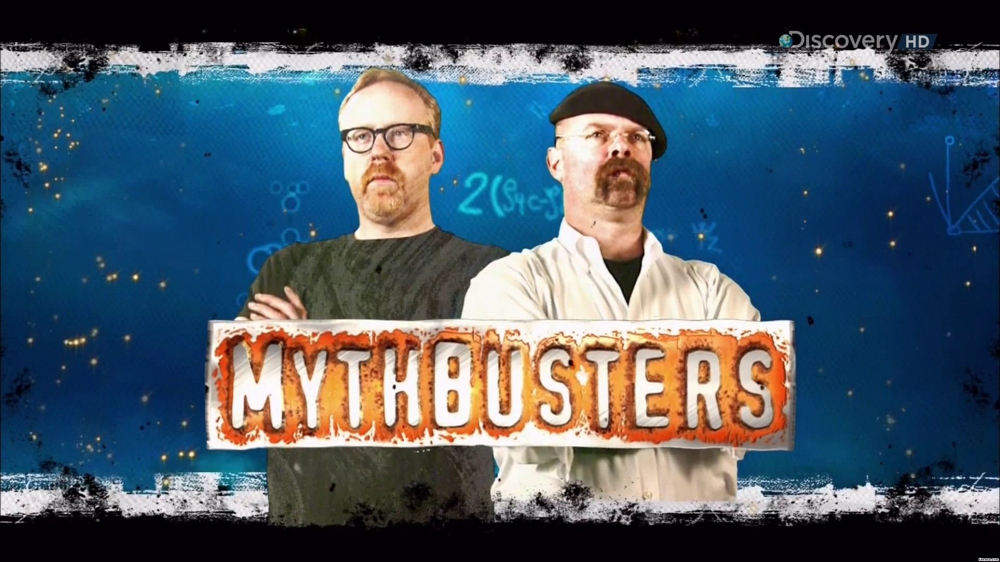
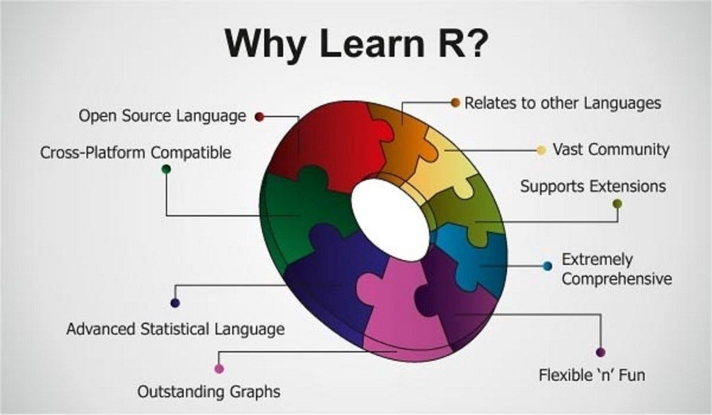
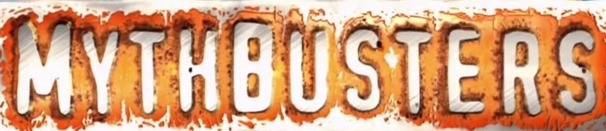
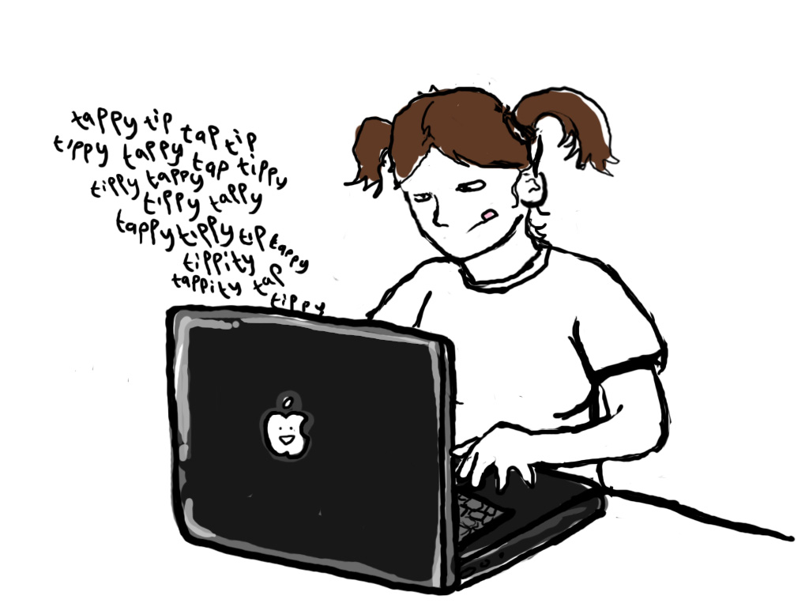
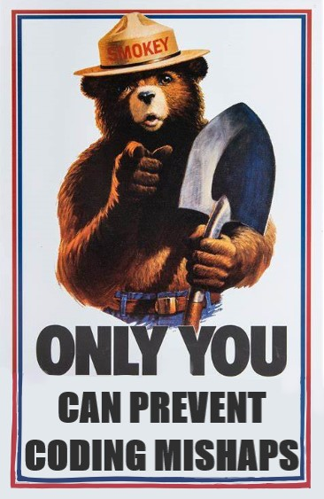
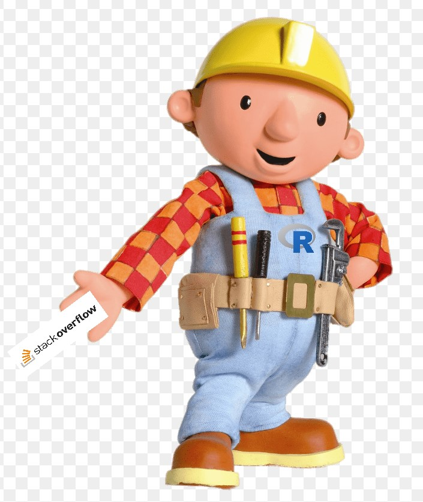
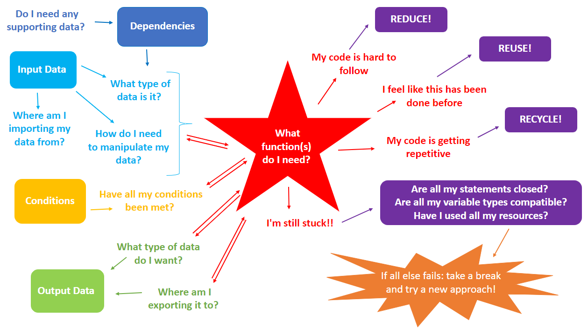

```{r setup, include=FALSE}
knitr::opts_chunk$set(echo = TRUE)
```

# R Best Practices {.tabset .tabset-pills}

Today we will be de-bunking coding myths and misconceptions. 



You may have previously thought one of the following: 

"Why am I doing this??"

"I keep getting errors and I don't know why!!"

"How did they know the answer to that?" 

"Where do I even begin?!?"

If you've said these to yourself or have felt similar  emotions of frustration towards coding, this training is for YOU!! 

In today's session we will cover the purpose and benefits of R, debunk common coding myths, and equip you with a tool belt of resources for success!

Towards the end, we will dive deeper into ways to optimize your code via functional programming and iterations. 

Agenda: 
1. Why R? 
2. Debunking Common Coding Myths 
3. Best Practices Principles 
4. Problem Solving Workflow 
5. Functional Programming 
6. Iterations Expansion 


</br>


## 1. Why R? 

"Why am I doing this??"

  - As introduced in previous sessions, R is one of the leading programming languages for statistics and data visualization, especially in the ecological community. 
  
  


As you can see, R's strength comes from all of these elements working together. 

The beauty of the being open source and part of a collaborative community, is that you don't need to know how to do everything in order to succeed. People are constantly writing new code and sharing how they solved their problems via forums, reports, and packages. 

To review, packages are like the "expansion pack" or "power ups" in R code that allow you to perform tasks that don't come in the base language. For a deeper dive revisit Laura's [What is an R Package Guide](https://doimspp.sharepoint.com/:w:/r/sites/nps-SWNC/Shared%20Documents/SWNC%20All%20Staff/SWNC%20R%20Trainings/3%20-%20What%20is%20a%20package.docx?d=we63a96814b614a668fe5da83df8c82ba&csf=1&web=1&e=8gc1mc).

Packages are constantly being built, updated, and can be adapted based on user needs which meas R is always getting better as time goes forward. There is also a vast world of documentation that if you know how to look for it, allows you to learn as you code. 

Finally, of the largest principles that is important to keep in mind throughout your coding journey is the concept of **Reproducibility**. Ultimately, we want our code and processes to be able to be reproduced over time, by different people, and have it apply to as much data as possible. When following best practices, R can open up a world of possibilities by cutting down the time and effort needed to analyze, process, and visualize our data. 

In today's session we hope to be able to give you the tools to learn from and engage with the coding community in a sustainable manner. We know that like any language, R has a steep learning curve to it, so we want to break down as many barriers as we can for you to succeed. 


## 2. Debunking Common Coding Myths 



Let's start off by breaking down common misconceptions that throw people off when they begin to learn how to code. 

### Myth #1: "I keep getting errors and I don't know why!!"

R likes to use bright red text for errors and warnings. However they shouldn't all have the same overwhelming sense of doom as implied by the color. It's important to learn how to distinguish a warning from an error, as well as learning how to decoding its message.


This handy graphic from [R @R(D)SVS](https://jillymackay.github.io/RatRDSVS/trouble.html) helps us do both! 


The nice thing about R is that it often gives you a reason for why things have happened, which makes it a lot easier to troubleshoot your code. It also means that messages might pop up out of the blue and throw you off. Take the following example: 


As you can see there's scary red text, however if you take a closer look you can see that its just giving you more info on the package being installed, and isn't actually a warning or error! 


### Myth #2: "I've done the exact same thing you did and it isn't working!! R must hate me"

There will be times where you feel like you've typed the exact same thing over and over again and it isn't working, even thought it looks "exactly the same". Often the issue will be as small as a syntax error. 

R is very particular in its formatting, so something as small as a . or a } can trip up the code. This is why its important to double check your code, or compare with a friend who may be able to spot something that you missed after staring at the screen for so long. 

**To Do**: Take a look at the code below and try to figure out the issue in each example:

```{r, example}

#example 1 
letters<- c("R", "C," "B")

#example 2
x <- 7 
if(x > 10) {
  print("x > 10")
 else {
  print("x <= 10")
 }

#example 3
  data <- data.frame(
  x = rnorm(10),
  y = rnorm(10)
)
summary(dta[, 2])

```


This [blog post](https://statsandr.com/blog/top-10-errors-in-r/#using-a-function-that-is-not-installed-or-loaded) has more great examples of many common errors and how to fix them


### Myth #3: "Coders like Sam and Laura know the answers off the top of their head!! I'll never get there" 

Although it may seem like we have all the answers, Laura and I area constantly learning, and often are furiously googling error messages and keywords to get an answer to our problem 


Sure, after a while you start to remember how to solve common errors like typos and open brackets, but for the most part a skilled coder is just a skilled researcher and very VERY patient. 

## 3. Best Practices Principles 

But I still feel like I don't know anything!!! My computer is going to explode!! 
 
Just Remember... 


Let's go over coding best practices and build your tool belt for success! 

*"How did they know the answer to that?"* 

As mentioned earlier, skilled coders are just skilled googlers (if that's even a verb)
### Tool #1: Utilize your resources !!!

Remember that R is open source, so there loads of documentation out there for you to learn more about the packages and functions you're using. My favorite online resources are Google, [Stack Overflow](https://stackoverflow.com/), and [Geeks for Geeks](https://www.geeksforgeeks.org/). Sometimes its as easy as copy and pasting in the error message, and other times you have to be clever with the keywords you're using.

Even better, R also has its own [documentation](https://www.rdocumentation.org/) on the packages on its server. This can also be accessed using the ? and ?? in the console (bottom left), or the 'Packages' and 'Help' tabs (bottom right). 

Let's explore the 'CreatePackageReport' function in the 'pkgnet' package 

**To Do**: Install and load the 'pkgnet' package 
```{r, pkginstall}
#install.packages('pkgnet')
library(pkgnet)
```

**To Do**: Using your preferred method, explore the 'pkgnet' package and create a package report of the 'tidyr' package
```{}
#create a package report of the tidyr package 
```


Finally, [pair programming](https://www.geeksforgeeks.org/pair-programming/) is one of the most effective resources at your disposal. to use the cheesy yet true phrase: "two heads are better than one"  
<br>
    
*"It's been a month since I last coded and I don't remember what this even does!"* 
### Tool #2: Get in the habit of using detailed documentation and version control 

Often people believe that documentation and version control are only needed when you're working on a project with a team. However this could be further from the case. Detailed documentation is key to understanding your code down the line, and version control allows you to go back in time and see what you've done. 

I like to think of both as a letter to my future self. Since code doesn't come naturally to most people, annotating in familiar language makes it a lot easier to come back to. You also never know if a project will become collaborative down the line, so its useful to be able to have the documentation written as you go, so that its easier to explain to future users. 

Similarly, version control like GitHub allows you to go back in time, which allows you to take more risks when modifying code. For example, say you've got code that works to complete a task for certain parameters and you've been tasked to expand those parameters. with GitHub you can edit the code you've already written and if it ends up breaking your code you can just go back and replace it with your old code. 

The next task is for those who have had experience using GitHub. If you haven't gone over our GitHub training yet or need a refresher, come back to this section once you've completed that training. We will go over this during today's session so that it can be a reference in the recording, but don't worry if this all seems new to you right now.  

**To Do**: Go to this training GitHub Repository, and look for the commit that says "code that works for Tool #2" to find the solution to the following broken code.
```{r}
# Program to check if the input number is odd or even.
# A number is even if division by 2 give a remainder of 0.
# If remainder is 1, it is odd.
num = as.integer(readline(prompt="Enter a number: "))
if((num %% 2) == 0) {
print(paste(num))
 else {
print(paste(num))
}
```
### Tool #3: Reduce, Reuse, Recycle 

Just like the earth, we want to keep our code as clean as possible! 


REDUCE: clunky or unorganized code. 

Use variable names that are concise, consistent, unique, and have meaning. Your initial instinct will be to name variables as quickly as possible, but just remember that you're communicating to both your future self AND future users. For a deep dive on naming conventions, visit Programming Duck's [ultimate guide and reference](https://programmingduck.com/articles/naming).

**To Do**: Rename the column names in the following data frame 
```{r}
groceries<- data.frame(
  FOOD.NAMES=c("potatos", "cereal", "milk"),
  money.well.spent=c(1.5, 3.40, 3.59),
  StoreBoughtFrom=c("Safeway", "TraderJoes", "Walmart")
)
```


REUSE: code that you've used before

Throughout the SWNC R training Series, we have frequently reused code examples from work us and others have done in the past. As long as you understand the code and cite appropriately, code is fair game and its in fact encouraged to reuse code. Remember R is open source and there's no point in re-inventing the wheel!! 

**To Do**: Run the code below adapted from the first data wrangling session to standardize your column names 
```{r}
library(janitor)
groceries_clean <- groceries %>%
  clean_names()
```


RECYCLE: repetitive code into a pipeline, function, or iteration! 

*"I feel like I've written the same thing over and over again"*  

If you feel like you've been writing the same chunk of code over and over again and only replacing one or two things each time, consider optimizing that code with a pipeline, function or iteration! 

Remember that the pipeline is a great way to reduce repetitive code when applying multiple functions on the same variable: 


Similarly, using iteration and creating your own functions are key in optimizing speed, storage, and time when writing code. The last two sections of today's training will be a deep dive on creating functions and iterations(specifically lapply) so stay tuned! 


### Bonus Tool: Take breaks and have fun !!!

Code can get annoying at times so remember to take the time to release frustration through breaks! When's the last time you went on a walk or had a snack? Thank your brain and give it a moment to refresh before diving back into your code - often this will lead to new insights when you're stuck on a problem. the nice thing about coding is theres many ways to accomplish the same task so if all else fails take a break and try a new approach!! :)


Amazing work! We've built our toolbelt of success and are ready to start coding! 
 

## 4. Problem Solving Workflow 

*"Where do I even begin?!?"*


Now you have both the tools and the roadmap to success!! 

## 5. Functional Programming 
 
Functional programming is the art of constructing and applying functions to variables in your code. It is basically the core of writing code in R. Whenever you are manipulating an object you are using, or "calling" a function to do so. Knowing how to write and call functions allows you to optimize the core principle of reproducibility.
 
The basic elements of the function is a name, argument(input), function body(statements to execute), and return value(output). 


We've been using functions throughout this entire training series, however for the most part they've been functions from base R or loaded packages. To optimize your code when running specific tasks, its important to learn how to make your own functions to synthesize tasks.  
 
**To Do**: Let's make a function that lets us know if a number is positive, or negative using our roadmap to success. 

```{r}
#To build our function we need to know the following elements: 
#function name
#argument
#function body 
#return value 

DefineNumber<- function(num){
  if(num>0){
    print(paste(num, "is positive"))
  }else{
    print(paste(num, "is negative"))
  }

}

#Reminders: 
#have all my conditions been met? 
#are all my statements closed? 
#are all my variable types compatible? 
```
 
**To Do**: Take a look at the environment in the upper right corner, you should see your new function in the 'Functions' category


**To Do**: Test your function out below 

```{r}
DefineNumber(5)
DefineNumber(-1)
DefineNumber(-5)
```
Nice work!! 

Notice how to test out your function you had to rewrite almost the same thing every time. Iterations will help us reduce this redundancy! 
 
 
## 6. Iterations Expansion 

For loops and lapply statements allow us to perform the same function on multiple variables, without having to run it individually each time.  

```{r}
series<-c(-1,4,900,-27,45,79,-35,-4670)
```

```{r}
#generate a for loop 
for (i in series){
  DefineNumber(i)
}
```

```{r}
list<-lapply(series, function(i){
  DefineNumber(i)
  }
  )
```
  
  
## Re(Sources)

Towardsdatascience.com
[Why R](https://medium.datadriveninvestor.com/learning-r-programming-b0bbd246ada4)
[10 most common coding mistakes](https://www.makeuseof.com/tag/common-programming-coding-mistakes/#:~:text=Knowing%20mistakes%20coders%20make%2C%20and%20how,will%20come%20across%20as%20you%20learn.&text=Knowing%20mistakes%20coders%20make%2C,across%20as%20you%20learn.&text=coders%20make%2C%20and%20how,will%20come%20across%20as) 
[What is an R Package](https://doimspp.sharepoint.com/:w:/r/sites/nps-SWNC/Shared%20Documents/SWNC%20All%20Staff/SWNC%20R%20Trainings/3%20-%20What%20is%20a%20package.docx?d=we63a96814b614a668fe5da83df8c82ba&csf=1&web=1&e=8gc1mc)
[pkgnet package](https://uptake.github.io/pkgnet/index.html)
[even vs odd](https://www.datamentor.io/r-programming/examples/odd-even/)
[Troubleshooting](https://jillymackay.github.io/RatRDSVS/trouble.html)
